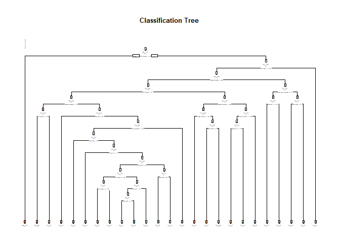

```r
library(ggplot2)
library(caret)
```

```
## Loading required package: lattice
```

```r
library(randomForest)
```

```
## randomForest 4.6-12
```

```
## Type rfNews() to see new features/changes/bug fixes.
```

```
## 
## Attaching package: 'randomForest'
```

```
## The following object is masked from 'package:ggplot2':
## 
##     margin
```

```r
library(rpart)
library(rpart.plot)
```

## Loading data

```r
training <- read.csv("pml-training.csv", na.strings=c("NA","#DIV/0!", ""))
testing <- read.csv("pml-testing.csv", na.strings=c("NA","#DIV/0!", ""))
```


## PreProcess
# Feature Selection

First remove near zero variance features, empty columns and NA columns from test and train dataset


```r
nzvcol1 <- nearZeroVar(training)
training <- training[,-nzvcol1]
training <- training[,-(1:7)]
training[training == ""] <- NA
training <- training[, colSums(is.na(training)) == 0]

nzvcol2 <- nearZeroVar(testing)
testing <- testing[,-nzvcol2]
testing[testing == ""] <- NA
testing <- testing[,-(1:7)]
testing <- testing[, colSums(is.na(testing)) == 0] 
```

## Train the model


1.Partitioning

```r
set.seed(23333)
intrain <- createDataPartition(training$classe,p=0.7,list=FALSE)
train <- training[intrain,]
validation <- training[-intrain,]
```

2.Random forest

```r
modfit1 <- randomForest(classe~.,data=train,type = "class")

print(modfit1)
```

```
## 
## Call:
##  randomForest(formula = classe ~ ., data = train, type = "class") 
##                Type of random forest: classification
##                      Number of trees: 500
## No. of variables tried at each split: 7
## 
##         OOB estimate of  error rate: 0.53%
## Confusion matrix:
##      A    B    C    D    E class.error
## A 3902    3    0    1    0 0.001024066
## B   13 2638    7    0    0 0.007524454
## C    0   20 2375    1    0 0.008764608
## D    0    0   23 2228    1 0.010657194
## E    0    0    0    4 2521 0.001584158
```

3.Rpart

```r
modfit2 <- rpart(classe~.,data=train)

print(modfit2)
```

```
## n= 13737 
## 
## node), split, n, loss, yval, (yprob)
##       * denotes terminal node
## 
##     1) root 13737 9831 A (0.28 0.19 0.17 0.16 0.18)  
##       2) pitch_forearm< -33.95 1095    9 A (0.99 0.0082 0 0 0) *
##       3) pitch_forearm>=-33.95 12642 9822 A (0.22 0.21 0.19 0.18 0.2)  
##         6) accel_belt_z>=-187.5 11919 9105 A (0.24 0.22 0.2 0.19 0.15)  
##          12) magnet_dumbbell_y< 439.5 9997 7248 A (0.27 0.18 0.23 0.19 0.13)  
##            24) roll_forearm< 122.5 6258 3802 A (0.39 0.17 0.18 0.16 0.096)  
##              48) magnet_dumbbell_z< -27.5 2039  688 A (0.66 0.21 0.012 0.071 0.047)  
##                96) roll_forearm>=-136.5 1691  383 A (0.77 0.17 0.014 0.018 0.029) *
##                97) roll_forearm< -136.5 348  206 B (0.12 0.41 0.0057 0.33 0.14) *
##              49) magnet_dumbbell_z>=-27.5 4219 3114 A (0.26 0.16 0.26 0.2 0.12)  
##                98) yaw_belt>=168.5 525   82 A (0.84 0.082 0.0019 0.067 0.0057) *
##                99) yaw_belt< 168.5 3694 2614 C (0.18 0.17 0.29 0.22 0.14)  
##                 198) accel_dumbbell_y>=-40.5 3171 2358 D (0.21 0.19 0.21 0.26 0.14)  
##                   396) pitch_belt< -43.25 310   47 B (0.013 0.85 0.068 0.026 0.045) *
##                   397) pitch_belt>=-43.25 2861 2056 D (0.23 0.12 0.22 0.28 0.15)  
##                     794) yaw_arm< -117 208    5 A (0.98 0.024 0 0 0) *
##                     795) yaw_arm>=-117 2653 1848 D (0.17 0.13 0.24 0.3 0.16)  
##                      1590) pitch_belt>=-40.45 1796 1313 D (0.24 0.16 0.1 0.27 0.23)  
##                        3180) pitch_forearm< 0.425 434  189 A (0.56 0.058 0.016 0 0.36)  
##                          6360) accel_forearm_x>=-56 290   46 A (0.84 0.086 0.01 0 0.062) *
##                          6361) accel_forearm_x< -56 144    5 E (0.0069 0 0.028 0 0.97) *
##                        3181) pitch_forearm>=0.425 1362  879 D (0.14 0.19 0.13 0.35 0.19)  
##                          6362) yaw_belt< -87.65 871  623 B (0.19 0.28 0.16 0.2 0.16)  
##                           12724) yaw_belt>=-93.25 727  479 B (0.23 0.34 0.18 0.067 0.18) *
##                           12725) yaw_belt< -93.25 144   15 D (0.021 0 0.049 0.9 0.035) *
##                          6363) yaw_belt>=-87.65 491  186 D (0.035 0.031 0.067 0.62 0.25) *
##                      1591) pitch_belt< -40.45 857  397 C (0.022 0.054 0.54 0.38 0.012)  
##                        3182) yaw_belt< 163.5 344   39 C (0.047 0.032 0.89 0.0058 0.029) *
##                        3183) yaw_belt>=163.5 513  193 D (0.0058 0.068 0.3 0.62 0) *
##                 199) accel_dumbbell_y< -40.5 523  103 C (0.0096 0.04 0.8 0.031 0.12) *
##            25) roll_forearm>=122.5 3739 2523 C (0.078 0.18 0.33 0.23 0.19)  
##              50) magnet_dumbbell_y< 290.5 2166 1129 C (0.096 0.13 0.48 0.15 0.14)  
##               100) magnet_forearm_z< -251 174   32 A (0.82 0.092 0 0.017 0.075) *
##               101) magnet_forearm_z>=-251 1992  955 C (0.033 0.14 0.52 0.16 0.15)  
##                 202) pitch_belt>=26.15 137   25 B (0.088 0.82 0.022 0 0.073) *
##                 203) pitch_belt< 26.15 1855  821 C (0.029 0.087 0.56 0.17 0.16) *
##              51) magnet_dumbbell_y>=290.5 1573 1040 D (0.054 0.25 0.11 0.34 0.25)  
##               102) accel_forearm_x>=-100.5 1023  678 E (0.049 0.31 0.16 0.14 0.34)  
##                 204) magnet_arm_y>=188.5 420  187 B (0.017 0.55 0.22 0.11 0.1) *
##                 205) magnet_arm_y< 188.5 603  301 E (0.071 0.14 0.12 0.16 0.5) *
##               103) accel_forearm_x< -100.5 550  162 D (0.064 0.12 0.029 0.71 0.078) *
##          13) magnet_dumbbell_y>=439.5 1922 1041 B (0.034 0.46 0.039 0.2 0.27)  
##            26) total_accel_dumbbell>=5.5 1366  560 B (0.048 0.59 0.053 0.018 0.29)  
##              52) gyros_belt_z>=-0.255 1207  404 B (0.054 0.67 0.06 0.018 0.2) *
##              53) gyros_belt_z< -0.255 159    5 E (0 0.019 0 0.013 0.97) *
##            27) total_accel_dumbbell< 5.5 556  188 D (0 0.13 0.0018 0.66 0.2)  
##              54) pitch_belt>=13.15 448   80 D (0 0.17 0.0022 0.82 0.0089) *
##              55) pitch_belt< 13.15 108    0 E (0 0 0 0 1) *
##         7) accel_belt_z< -187.5 723    7 E (0.0083 0.0014 0 0 0.99) *
```

```r
rpart.plot(modfit2, main="Classification Tree", extra=102, under=TRUE, faclen=0)
```

<!-- -->


4..Predict the model with validation set

```r
pred1 <- predict(modfit1,validation)
confusionMatrix(validation$classe, pred1)
```

```
## Confusion Matrix and Statistics
## 
##           Reference
## Prediction    A    B    C    D    E
##          A 1669    5    0    0    0
##          B    3 1135    1    0    0
##          C    0    3 1022    1    0
##          D    0    0   15  948    1
##          E    0    0    0    2 1080
## 
## Overall Statistics
##                                           
##                Accuracy : 0.9947          
##                  95% CI : (0.9925, 0.9964)
##     No Information Rate : 0.2841          
##     P-Value [Acc > NIR] : < 2.2e-16       
##                                           
##                   Kappa : 0.9933          
##  Mcnemar's Test P-Value : NA              
## 
## Statistics by Class:
## 
##                      Class: A Class: B Class: C Class: D Class: E
## Sensitivity            0.9982   0.9930   0.9846   0.9968   0.9991
## Specificity            0.9988   0.9992   0.9992   0.9968   0.9996
## Pos Pred Value         0.9970   0.9965   0.9961   0.9834   0.9982
## Neg Pred Value         0.9993   0.9983   0.9967   0.9994   0.9998
## Prevalence             0.2841   0.1942   0.1764   0.1616   0.1837
## Detection Rate         0.2836   0.1929   0.1737   0.1611   0.1835
## Detection Prevalence   0.2845   0.1935   0.1743   0.1638   0.1839
## Balanced Accuracy      0.9985   0.9961   0.9919   0.9968   0.9993
```

```r
pred2 <- predict(modfit2,validation,type="class")
confusionMatrix(validation$classe, pred2)
```

```
## Confusion Matrix and Statistics
## 
##           Reference
## Prediction    A    B    C    D    E
##          A 1488   93   31   42   20
##          B  158  756   91   97   37
##          C   13  150  753   91   19
##          D   46   93  140  636   49
##          E   36  212  182   72  580
## 
## Overall Statistics
##                                           
##                Accuracy : 0.7159          
##                  95% CI : (0.7042, 0.7274)
##     No Information Rate : 0.2958          
##     P-Value [Acc > NIR] : < 2.2e-16       
##                                           
##                   Kappa : 0.6401          
##  Mcnemar's Test P-Value : < 2.2e-16       
## 
## Statistics by Class:
## 
##                      Class: A Class: B Class: C Class: D Class: E
## Sensitivity            0.8547   0.5798   0.6291   0.6780  0.82270
## Specificity            0.9551   0.9164   0.9418   0.9337  0.90309
## Pos Pred Value         0.8889   0.6637   0.7339   0.6598  0.53604
## Neg Pred Value         0.9399   0.8845   0.9086   0.9386  0.97397
## Prevalence             0.2958   0.2216   0.2034   0.1594  0.11980
## Detection Rate         0.2528   0.1285   0.1280   0.1081  0.09856
## Detection Prevalence   0.2845   0.1935   0.1743   0.1638  0.18386
## Balanced Accuracy      0.9049   0.7481   0.7854   0.8059  0.86289
```

We have reached a 99.7% of accuracy by using random forest. The accuracy rate of random forest is 
higher than rpart. Therefore we choose random forest to make the prediction on test dataset.

## Apply to the test dataset


```r
finalpred <- predict(modfit1,testing,type="class")
finalpred
```

```
##  1  2  3  4  5  6  7  8  9 10 11 12 13 14 15 16 17 18 19 20 
##  B  A  B  A  A  E  D  B  A  A  B  C  B  A  E  E  A  B  B  B 
## Levels: A B C D E
```

Save the output

```r
answers <- as.vector(finalpred)

pml_write_files = function(x) {
    n = length(x)
    for (i in 1:n) {
        filename = paste0("problem_id_", i, ".txt")
        write.table(x[i], file = filename, quote = FALSE, row.names = FALSE, 
            col.names = FALSE)
    }
}

pml_write_files(answers)
```
